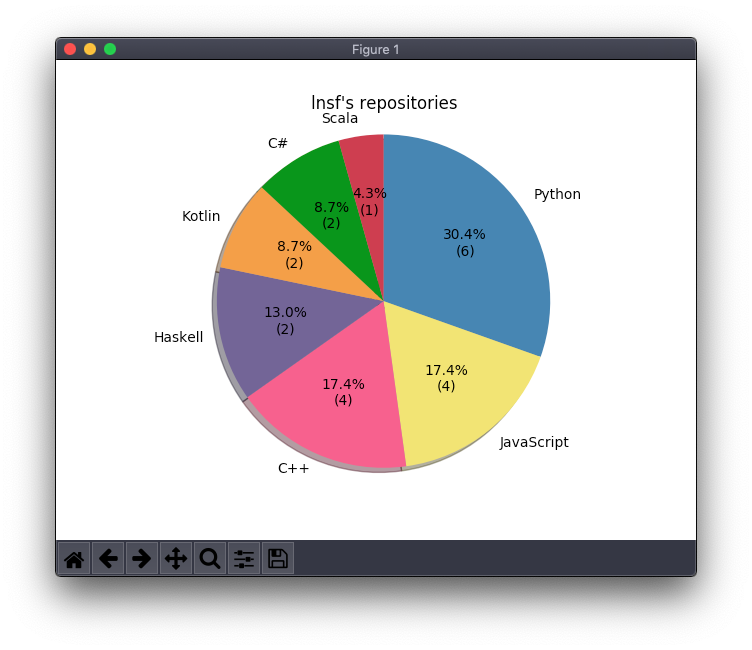

# github-userlang
Create pie chart about programming languages the user used



## setup

Clone this repository and then install it using pip3.

```sh
git clone https://github.com/lnsf/github-userlang
cd github-userlang
pip3 install -U .
```

## usage

```sh
gh-userlang
```

Then some prompt will appear.  
You must input these contents.

1. **YOUR** username
1. **YOUR** password
1. username you want to make a pie chart
